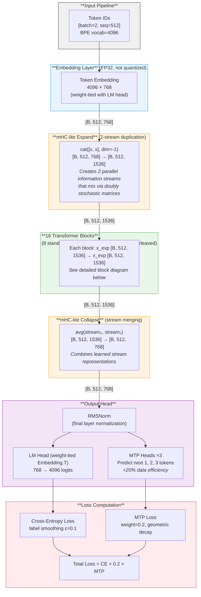
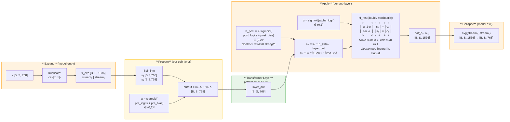
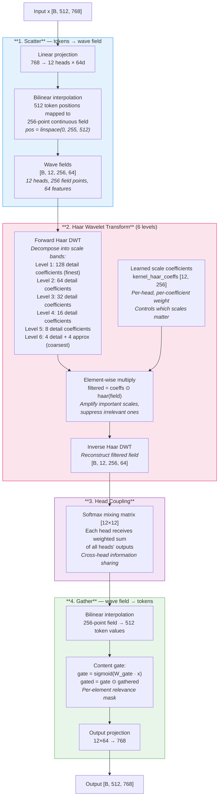
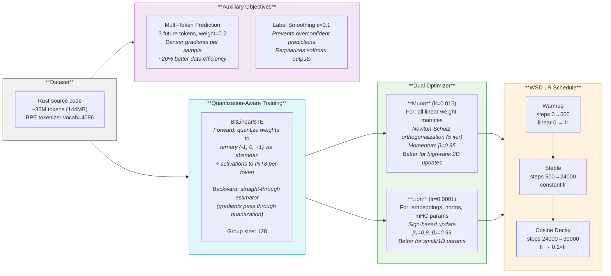
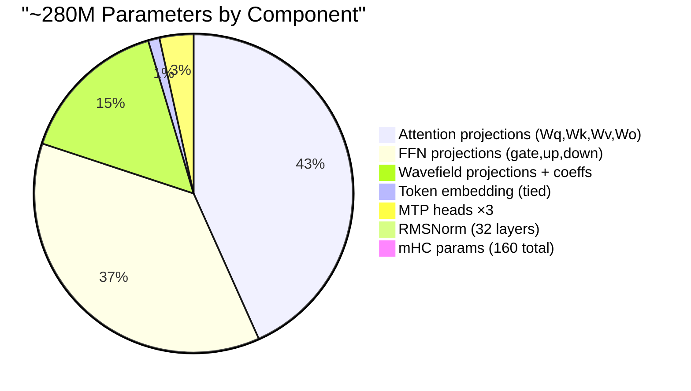

# nano-500m-wave-haar Architecture

> A ~280M parameter transformer language model trained on Rust source code,
> featuring **Haar wavelet attention**, **mHC-lite doubly stochastic residuals**,
> and **ternary quantization-aware training (QAT)**.

## High-Level Forward Pass

## Single Transformer Block (Detailed)

Each of the 16 blocks follows this structure. The key innovation is that
**residual connections flow through mHC doubly stochastic mixing matrices**
instead of simple addition, preventing signal amplification across depth.

```mermaid
flowchart TD
    x_in["x_exp input<br/>[B, 512, 1536]<br/><i>2-stream expanded representation</i>"]

    subgraph ATTN_SUB["**Attention Sub-Layer**"]
        direction TB

        subgraph ATTN_MHC_PRE["mHC Prepare (stream → single)"]
            attn_prepare["w = sigmoid(pre_logits + pre_bias)<br/>out = w₀·stream₀ + w₁·stream₁<br/>[B, 512, 1536] → [B, 512, 768]<br/><i>Learned weighted mix of streams</i>"]
        end

        attn_norm["RMSNorm<br/><i>Pre-norm stabilization</i>"]

        attn_choice{{"Layer type?"}}

        subgraph STD_ATTN["**Standard GQA Attention**<br/>(layers 0,2,4,6,8,10,12,14)"]
            std_qkv["Q = Wq·x (12 heads × 64d)<br/>K = Wk·x (4 KV heads × 64d)<br/>V = Wv·x (4 KV heads × 64d)<br/><i>Grouped Query Attention: 3 Q heads share 1 KV head</i>"]
            std_rope["RoPE: rotate Q,K by position<br/><i>Relative position encoding via<br/>complex-valued rotation</i>"]
            std_sdpa["Scaled Dot-Product Attention<br/>scores = Q·Kᵀ / √64<br/>+ causal mask (upper triangle = -∞)<br/>attn = softmax(scores) · V"]
            std_out["Output projection: Wo · attn<br/>[B, 512, 768]"]

            std_qkv --> std_rope --> std_sdpa --> std_out
        end

        subgraph WAVE_ATTN["**Haar Wavefield Attention**<br/>(layers 1,3,5,7,9,11,13,15)"]
            wave_scatter["Scatter: project tokens onto<br/>continuous wave field via<br/>bilinear interpolation<br/>[B, 512, 768] → [B, 12, 256, 64]<br/><i>256-point field per head</i>"]
            wave_haar["Haar DWT (6 levels)<br/>Decompose field into<br/>wavelet scale coefficients"]
            wave_scale["Scale-selective filtering:<br/>filtered = haar_coeffs ⊙ haar(field)<br/><i>12×256 learned coefficients control<br/>which scales (coarse↔fine) to amplify</i>"]
            wave_ihaar["Inverse Haar DWT<br/>Reconstruct filtered field"]
            wave_couple["Head coupling:<br/>softmax mixing across 12 heads<br/><i>Heads share information</i>"]
            wave_gather["Gather: interpolate back<br/>to token positions<br/>[B, 12, 256, 64] → [B, 512, 768]"]
            wave_gate["Content gate:<br/>gate = sigmoid(Wg·x)<br/>out = gate ⊙ gathered<br/><i>Learned relevance weighting</i>"]
            wave_out["Output projection: Wo · gated<br/>[B, 512, 768]"]

            wave_scatter --> wave_haar --> wave_scale --> wave_ihaar
            wave_ihaar --> wave_couple --> wave_gather --> wave_gate --> wave_out
        end

        subgraph ATTN_MHC_POST["mHC Apply (residual + stream mix)"]
            attn_apply["Add residual to each stream:<br/>s₀' = s₀ + h_post₀ · attn_out<br/>s₁' = s₁ + h_post₁ · attn_out<br/><br/>Doubly stochastic mixing:<br/>α = sigmoid(alpha_logit)<br/>out₀ = α·s₀' + (1-α)·s₁'<br/>out₁ = (1-α)·s₀' + α·s₁'<br/>[B, 512, 1536]"]
        end

        attn_prepare --> attn_norm --> attn_choice
        attn_choice -->|"Even layer"| std_qkv
        attn_choice -->|"Odd layer"| wave_scatter
        std_out --> attn_apply
        wave_out --> attn_apply
    end

    subgraph FFN_SUB["**FFN Sub-Layer**"]
        direction TB

        subgraph FFN_MHC_PRE["mHC Prepare (stream → single)"]
            ffn_prepare["w = sigmoid(pre_logits + pre_bias)<br/>out = w₀·stream₀ + w₁·stream₁<br/>[B, 512, 1536] → [B, 512, 768]"]
        end

        ffn_norm["RMSNorm"]

        subgraph SWIGLU["**SwiGLU Feed-Forward Network**"]
            ffn_gate["gate = silu(W_gate · x)<br/><i>768 → 2048, swish activation</i>"]
            ffn_up["up = W_up · x<br/><i>768 → 2048, linear</i>"]
            ffn_mul["hidden = gate ⊙ up<br/><i>Element-wise gating</i>"]
            ffn_down["out = W_down · hidden<br/><i>2048 → 768</i>"]

            ffn_gate --> ffn_mul
            ffn_up --> ffn_mul
            ffn_mul --> ffn_down
        end

        subgraph FFN_MHC_POST["mHC Apply (residual + stream mix)"]
            ffn_apply["Same doubly stochastic residual<br/>as attention sub-layer above<br/>(separate learned α, pre, post params)"]
        end

        ffn_prepare --> ffn_norm --> ffn_gate
        ffn_norm --> ffn_up
        ffn_down --> ffn_apply
    end

    x_out["x_exp output<br/>[B, 512, 1536]"]

    x_in --> attn_prepare
    x_in -.->|"skip connection<br/>(through mHC)"| attn_apply
    attn_apply --> ffn_prepare
    attn_apply -.->|"skip connection<br/>(through mHC)"| ffn_apply
    ffn_apply --> x_out

    style ATTN_SUB fill:#e8f5e9,stroke:#4CAF50
    style FFN_SUB fill:#e8f5e9,stroke:#4CAF50
    style STD_ATTN fill:#e3f2fd,stroke:#2196F3
    style WAVE_ATTN fill:#fce4ec,stroke:#E91E63
    style SWIGLU fill:#f3e5f5,stroke:#9C27B0
    style ATTN_MHC_PRE fill:#fff3e0,stroke:#FF9800
    style ATTN_MHC_POST fill:#fff3e0,stroke:#FF9800
    style FFN_MHC_PRE fill:#fff3e0,stroke:#FF9800
    style FFN_MHC_POST fill:#fff3e0,stroke:#FF9800
```

## mHC-lite N=2: Doubly Stochastic Residual Connections

Traditional transformers use simple addition for residuals (`x = x + layer(x)`),
which can cause **signal amplification** — after 64 layers, the residual stream's
amplitude can grow 3000×. mHC-lite constrains the mixing matrix to be
**doubly stochastic** (all rows and columns sum to 1), guaranteeing bounded signal flow.

## Haar Wavefield Attention (Detail)

Instead of computing pairwise token interactions (O(n²) attention),
wavefield attention projects tokens onto a **continuous wave field**,
applies **Haar wavelet filtering** in the transform domain, then gathers
results back. This gives each head **scale-selective** filtering — it can
independently amplify or suppress coarse (global) vs fine (local) features.

## Training Configuration

## Parameter Breakdown

## Key Innovations

| Component | What it does | Why it matters |
|-----------|-------------|----------------|
| **mHC-lite** | Doubly stochastic residual mixing via BvN decomposition | Prevents signal amplification across 16 layers (traditional residuals can grow 3000× at depth 64) |
| **Haar Wavefield** | Wavelet-domain filtering instead of O(n²) attention | Scale-selective: independently control coarse (global context) vs fine (local syntax) features |
| **BitLinear STE** | Ternary weight quantization during training | Model learns to work with {-1, 0, +1} weights, enabling 16× compression at inference |
| **Muon + Lion** | Orthogonalized updates for matrices, sign-based for scalars | Better optimization landscape navigation for each parameter type |
| **Multi-Token Prediction** | Predict next 1, 2, 3 tokens simultaneously | 20% more learning signal per training sample |
| **Head Coupling** | Softmax mixing matrix across wavefield heads | Heads specialize on different frequency bands then share findings |
